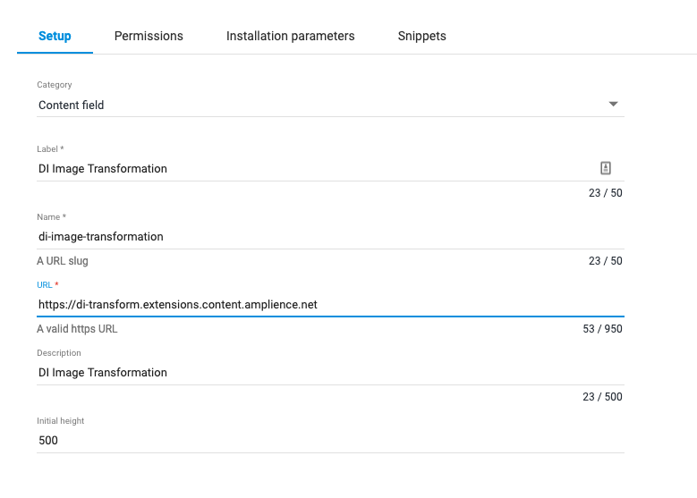

# dc-extension-di-transform

This UI extension lets you create an image transformation to attach to an image in DI, including crops, rotation and image effects.
Check out `schema.json` for the content schema to use with this extension. In future versions, you may need to update this schema to match any additions made to the functionality.

## Key features:

- Transform and preview of any image on the linked DAM account. Image and transforms are made available via the content item, as a query string and image link.
- Shows DAM previews on the side that show real outputs of the transformations from DAM.
- Supports cropping, flips and HSL modification.
  - Crops support interactive dragging over the image, aspect ratio locks.
  - HSL modification uses a software image filter to mimic what DI generates.
- Extendable to support more types of transformation.
- Support for rotation and POI on cropped image segments. Disabled for now.
- Query parameters created within the transformer are included in the content item as a prebaked query string.
- Can draw unpublished images using a VSE. useVSE: boolean by itself attempts to use the DC VSE, but you can also provide your own with customVSE.
- Result is shown as a preview card on any future loads into the content item.

## Parameters in Schema

Put the following in the `params` object to change features of the extension:
- `useVSE`: Set to true to use a VSE for fetching and rendering images. If this is false, images must be published to be seen.
- `customVSE`: Set to whatever your custom VSE's hostname is. Do not include `http://` or a trailing slash. `useVSE` must be true.
- `alwaysFullRes`: When true, the main preview image is always fetched at full resolution.

## How to install

### Register Extension

This extension needs to be [registered](https://amplience.com/docs/development/registeringextensions.html) against a Hub with in the Dynamic Content application (Developer -> Extensions), for it to load within that Hub.

* Category: Content Field
* Label: DI Image Transformation _(this will appear as the tab title in the Dashboard)_
* Name: di-image-transformation _(needs to be unique with the Hub)_
* URL: [https://di-transform.extensions.content.amplience.net](https://di-transform.extensions.content.amplience.net)
* Description: DI Image Transformation _(can be left blank, if you wish)_
* Initial height: 500

Note:
You can use our deployed version of this extension (builds from the "production" branch) -

[di-transform.extensions.content.amplience.net](di-transform.extensions.content.amplience.net)

_As this is an open source project you're welcome to host your own "fork" of this project. You can use any standard static hosting service (Netlify, Amplify, Vercel, etc.) if you wish._

##### Permissions

Sandbox permissions:
- Allow same origin

### Assign the extension to schema

- Log in, go to development and create a new schema.
- Enter "https://github.com/amplience/dc-extension-di-transform/blob/master/schema.json" as your ID (feel free to use another ID)
- Paste the contents of `schema.json` (if you entered a custom schema id, ensure you update the "$id" property to match)
- Save it. Go back to development and create a content type for your new schema.
- Go to Production and make as many content items as your heart desires.

## How to run locally:

This project requires Node 16.x to build.

- `npm install -g angular-cli` (if it is not already installed)
- `npm i`
- `ng serve`
- Head to `http://localhost:4200/` and accept the security risk.
- Go to any version of Amplience DC that supports UI extensions. (should be a given now)
- Log in, go to development and create a new schema. (if the schema is not already set up on that account)
- Paste the contents of `schema-localhost.json`
- Save it. Go back to development and create a content type for your new schema.
- Go to Production and make as many content items as your heart desires.

### Angular CLI

#### Development server

Run `ng serve` for a dev server. Navigate to `http://localhost:4200/`. The app will automatically reload if you change any of the source files.

#### Code scaffolding

Run `ng generate component component-name` to generate a new component. You can also use `ng generate directive|pipe|service|class|guard|interface|enum|module`.

#### Build

Run `ng build` to build the project. The build artifacts will be stored in the `dist/` directory. Use the `--prod` flag for a production build.

#### Running unit tests (wip)

Karma tests are not yet set up, but the regular angular-cli setup for them is present: Run `ng test` to execute the unit tests via [Karma](https://karma-runner.github.io).

#### Running end-to-end tests (wip)

End to end tests are not yet set up, but the regular angular-cli setup for them is present: Run `ng e2e` to execute the end-to-end tests via [Protractor](http://www.protractortest.org/).

#### Further help

To get more help on the Angular CLI use `ng help` or go check out the [Angular CLI README](https://github.com/angular/angular-cli/blob/master/README.md).
